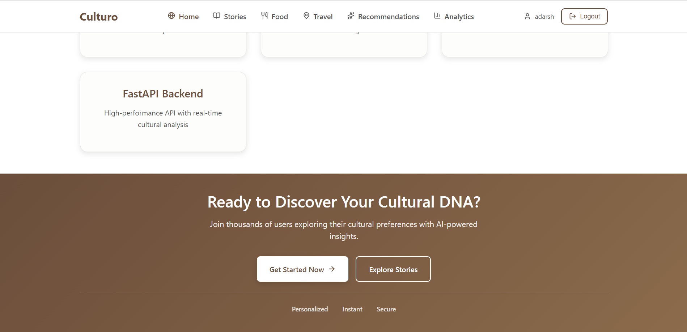

# 🌍 Culturo - Cultural Intelligence Platform

A comprehensive cultural intelligence platform that combines AI-powered analysis, personalized recommendations, story development, food intelligence, and travel planning. Culturo leverages the Qloo Taste API and advanced machine learning to provide deep cultural insights and personalized experiences.

## 🎬 Demo
[](https://youtu.be/ZQIFn6ogu5M)

Culturo Dashboard - Cultural intelligence and personalized recommendations

Advanced cultural analysis interface with AI-powered insights, multi-domain recommendations, and personalized experiences.

🖼️ **Project Screenshots**

**Homepage & Landing**



Modern landing page with cultural discovery features and AI-powered insights

**User Authentication**

Secure authentication with Clerk integration for seamless user experience

**User Registration**

User registration with cultural preference collection

**Story Development**

AI-powered story generation and development with audience analysis

**Food Analysis**

Comprehensive food analysis with nutritional insights and cultural context

**Travel Planning**


Intelligent travel itinerary generation with cultural insights
Detailed travel planning with personalized recommendations

**Recommendations**


Personalized cultural recommendations across multiple domains
Advanced recommendation system with cultural affinity analysis

**Analytics Dashboard**

Comprehensive analytics and user behavior tracking

🏗️ **System Architecture**

**Pipeline Overview**
```
┌─────────────────┐    ┌─────────────────┐    ┌─────────────────┐
│   Frontend      │    │   Backend API   │    │   AI Services   │
│   (React)       │◄──►│   (FastAPI)     │◄──►│   (LLMs)        │
└─────────────────┘    └─────────────────┘    └─────────────────┘
                              │
                              ▼
                       ┌─────────────────┐
                       │   Cultural Data │
                       │   (Qloo API)    │
                       └─────────────────┘
```

**System Flow Diagrams**
- **High-Level Architecture**: Multi-service architecture with AI integration
- **Data Flow Architecture**: Real-time cultural data processing

🚀 **Quick Setup**

**Automated Setup (Recommended):**
```bash
# Clone and setup
git clone https://github.com/your-username/culturo.git
cd culturo
python setup_project.py
```

**Manual Backend Setup:**
```bash
# Backend with FastAPI
cd culturo-backend
source venv/bin/activate  # or python -m venv venv
pip install -r requirements.txt
python main.py
```

**Manual Frontend Setup:**
```bash
# Frontend
cd culturo-frontend
npm install
npm run dev
```

**Access:**
- Frontend: http://localhost:5173
- Backend API: http://localhost:8000
- API Documentation: http://localhost:8000/docs

🎯 **Key Features**

🗄️ **Advanced Cultural Intelligence**
- **Qloo Integration**: Deep cultural affinity analysis using Qloo Taste API
- **Multi-domain Analysis**: Music, food, fashion, books, and more
- **Personalized Insights**: User-specific cultural preferences and recommendations
- **Real-time Processing**: Fast cultural analysis with caching

🧠 **Core AI Implementation**
- **Multi-LLM Support**: Gemini, OpenAI GPT, Claude, and more
- **Content Generation**: AI-powered story creation and content development
- **Cultural Context**: Deep understanding of cultural significance
- **Personalization**: User-specific recommendations and insights

🔄 **Multi-Service Analysis Pipeline**
- **Story Development**: AI-assisted story creation with audience analysis
- **Food Intelligence**: Text-based food analysis with nutritional insights
- **Travel Planning**: Culturally-aware trip itineraries
- **Recommendations**: Personalized suggestions across multiple domains

🎨 **Advanced User Experience**
- **Modern UI**: Clean, responsive design with TypeScript
- **Authentication**: Secure Clerk integration
- **Real-time Updates**: Live cultural insights and recommendations
- **Mobile-First**: Optimized for all device sizes

📦 **Comprehensive Analytics**
- **User Behavior Tracking**: Comprehensive analytics and insights
- **Performance Monitoring**: System health and performance metrics
- **Cultural Trends**: Analysis of cultural preferences and trends
- **Personalization Metrics**: Effectiveness of recommendation algorithms

📷 **Cultural Data Visualization**
- **Interactive Dashboards**: Real-time cultural insights visualization
- **Trend Analysis**: Visual cultural trend tracking
- **Personalization Charts**: User preference visualization
- **Recommendation Engine**: Visual recommendation system

⚡ **Fast Processing & Real-time Analysis**
- **Novel Insights**: Real-time cultural analysis with uncertainty
- **Adaptive Processing**: Intelligent processing based on user preferences
- **Chunked Processing**: Memory-efficient processing for large datasets
- **Performance Tracking**: Real-time processing performance metrics

📊 **Advanced Performance Monitoring**
- **Real-time Metrics**: Comprehensive system and cultural analysis performance
- **AI Analytics**: Detailed model performance and optimization metrics
- **Performance Alerts**: Configurable alerts for system performance
- **Resource Management**: Memory and system resource optimization

🏗️ **Architecture**

**System Overview**
```
┌─────────────────┐    ┌─────────────────┐    ┌─────────────────┐
│   Frontend      │    │   Backend API   │    │   AI Services   │
│   (React)       │◄──►│   (FastAPI)     │◄──►│   (LLMs)        │
└─────────────────┘    └─────────────────┘    └─────────────────┘
                              │
                              ▼
                       ┌─────────────────┐
                       │   Cultural APIs │
                       │   (Qloo)        │
                       └─────────────────┘
```

**Key Benefits of Culturo Architecture**
✅ **Real-time Analysis** - Live cultural data processing
✅ **Multi-domain Intelligence** - Multiple cultural domains
✅ **Advanced AI Models** - State-of-the-art language models
✅ **Comprehensive Analytics** - Robust user behavior tracking
✅ **Production Ready** - Scalable and maintainable architecture
✅ **Developer Friendly** - Easy to extend and customize

🚀 **Development Setup**

**Prerequisites**
- Python 3.9+
- Node.js 18+
- Neon DB account (free tier available)
- Redis (optional, for caching)
- API keys for:
  - Qloo Taste API
  - Google Gemini
  - OpenAI (optional)
  - Clerk (for authentication)

**Quick Start**
```bash
# Clone the repository
git clone https://github.com/your-username/culturo.git
cd culturo

# Backend Setup
cd culturo-backend
source venv/bin/activate
pip install -r requirements.txt
python main.py

# Frontend Setup (new terminal)
cd culturo-frontend
npm install
npm run dev
```

**Configuration**
```bash
# Copy credentials template
cp culturo-backend/.env.example culturo-backend/.env

# Edit with your API keys
nano culturo-backend/.env
```

**Access the Application**
- Frontend: http://localhost:5173
- Backend API: http://localhost:8000
- API Documentation: http://localhost:8000/docs

📁 **Project Structure**
```
Culturo/
├── culturo-frontend/          # React frontend application
│   ├── src/
│   │   ├── components/        # UI components
│   │   ├── pages/            # Application pages
│   │   │   ├── Home.tsx      # Landing page
│   │   │   ├── Stories.tsx   # Story development
│   │   │   ├── Food.tsx      # Food analysis
│   │   │   ├── Travel.tsx    # Travel planning
│   │   │   ├── Recommendations.tsx # Recommendations
│   │   │   ├── Analytics.tsx # User analytics
│   │   │   ├── SignIn.tsx    # Authentication
│   │   │   └── SignUp.tsx    # User registration
│   │   ├── services/         # API services
│   │   ├── contexts/         # React contexts
│   │   └── config.ts         # Application configuration
│   └── package.json          # Frontend dependencies
├── culturo-backend/          # FastAPI backend application
│   ├── app/
│   │   ├── models/           # Database models
│   │   ├── schemas/          # Pydantic schemas
│   │   ├── routers/          # API endpoints
│   │   ├── services/         # Business logic
│   │   └── ml/               # Machine learning models
│   ├── requirements.txt      # Python dependencies
│   └── README.md            # Backend documentation
├── image/                    # Application screenshots
│   ├── homepageimage1.png   # Homepage screenshot
│   ├── siginpageimage.png   # Sign in page
│   ├── signuppageimage.png  # Sign up page
│   ├── storiespageimage.png # Stories page
│   ├── foodanalysispageimage.png # Food analysis
│   ├── travelplanningpageimage1.png # Travel planning
│   ├── travelplanningpageimage2.png # Travel details
│   ├── recomendationpageimage1.png # Recommendations
│   ├── recomendationpageimage2.png # Recommendation details
│   └── analyticspageimage.png # Analytics dashboard
└── README.md                # This file
```

🔧 **API Endpoints**

**Authentication (Clerk)**
- `GET /api/v1/auth/me` - Get current user profile
- `GET /api/v1/auth/clerk/me` - Get Clerk user information
- `POST /api/v1/auth/clerk/verify` - Verify Clerk token
- `POST /api/v1/clerk/webhook` - Clerk webhook handler

**Cultural Analysis**
- `POST /api/v1/audience/analyze` - Analyze target audiences
- `POST /api/v1/cultural/insights` - Get cultural insights
- `GET /api/v1/cultural/trends` - Get cultural trends

**Story Development**
- `POST /api/v1/stories/analyze` - Analyze story ideas
- `POST /api/v1/stories/generate` - Generate story content
- `POST /api/v1/stories/surprise` - Get random story prompts

**Food Intelligence**
- `POST /api/v1/food/analyze` - Analyze food by name
- `POST /api/v1/food/recommendations` - Get food recommendations
- `GET /api/v1/food/nutrition` - Get nutritional information

**Travel Planning**
- `POST /api/v1/travel/plan` - Create travel itineraries
- `GET /api/v1/travel/destinations` - Get destination recommendations
- `POST /api/v1/travel/cultural-insights` - Get cultural insights

**Recommendations**
- `POST /api/v1/recommendations/personalized` - Get personalized recommendations
- `POST /api/v1/recommendations/cultural` - Get culturally-aware recommendations
- `GET /api/v1/recommendations/trending` - Get trending items

**Analytics**
- `GET /api/v1/analytics/user-behavior` - Get user behavior analytics
- `POST /api/v1/analytics/track` - Track user interactions
- `GET /api/v1/analytics/performance` - Get system performance metrics

📸 **Getting Started with Cultural Intelligence**

**Where to Get Cultural Data**
- **Qloo Taste API**: Primary cultural affinity data source
- **Google Gemini**: AI-powered content generation
- **OpenAI GPT**: Alternative LLM for specific tasks
- **Sample Data**: Use provided sample datasets

**Quick Cultural Analysis Setup**
```bash
# Start the application
cd culturo-backend
python main.py

# Access the dashboard
# Open http://localhost:5173 in your browser

# Create profile and start analysis
# Use the web interface to:
# 1. Sign up and create cultural profile
# 2. Explore story development
# 3. Analyze food preferences
# 4. Plan culturally-aware travel
# 5. Get personalized recommendations
```

🎯 **Usage Examples**

**Complete Cultural Analysis Workflow**
```python
# 1. Analyze cultural preferences
import requests

analysis_response = requests.post('http://localhost:8000/api/v1/cultural/insights', json={
    "user_id": "user123",
    "preferences": ["music", "food", "travel"],
    "analysis_type": "comprehensive"
})

# 2. Generate personalized story
story_response = requests.post('http://localhost:8000/api/v1/stories/generate', json={
    "user_id": "user123",
    "story_prompt": "A tale about cultural discovery",
    "genre": "adventure",
    "target_audience": "young adults"
})

# 3. Get food recommendations
food_response = requests.post('http://localhost:8000/api/v1/food/recommendations', json={
    "user_id": "user123",
    "cuisine_preferences": ["italian", "japanese"],
    "dietary_restrictions": ["vegetarian"]
})
```

**Real-time Cultural Monitoring**
```python
# Get cultural trends
trends = requests.get('http://localhost:8000/api/v1/cultural/trends')

# Monitor user behavior
analytics = requests.get('http://localhost:8000/api/v1/analytics/user-behavior')
```

🔧 **Configuration**

**Environment Variables**
```env
# API Keys
QLOO_API_KEY=your_qloo_api_key
GEMINI_API_KEY=your_gemini_api_key
OPENAI_API_KEY=your_openai_api_key

# Database
DATABASE_URL=your_neon_db_url
REDIS_URL=redis://localhost:6379/0

# Authentication
CLERK_SECRET_KEY=your_clerk_secret_key
CLERK_PUBLISHABLE_KEY=your_clerk_publishable_key

# Development
DEBUG=true
```

**AI Model Configuration**
```yaml
# AI Model Settings
models:
  gemini:
    model_name: "gemini-pro"
    temperature: 0.7
    max_tokens: 2048

# Cultural Analysis Settings
cultural_analysis:
  domains: ["music", "food", "fashion", "books", "travel"]
  confidence_threshold: 0.8
  cache_duration: 3600
```

🛠️ **Troubleshooting**

**Common Issues**
- "API key not found": Check .env configuration
- "Model loading failed": Ensure AI model credentials are correct
- "Cultural analysis failed": Check Qloo API connectivity
- "Authentication failed": Verify Clerk configuration
- "Tests failing": Check virtual environment and dependencies

**Performance Tips**
- Use Redis for caching cultural data
- Optimize AI model parameters for your use case
- Use more cultural domains for better recommendations
- Monitor system resources during analysis
- Implement proper error handling

🔒 **Security**

**Protected Files**
The following files are automatically ignored by Git:
- `.env` - API keys and secrets
- `*.pem, *.key, *.p12` - SSL certificates and private keys
- `venv/, node_modules/` - Virtual environments and dependencies

**Environment Variables**
For additional security, use environment variables:
```bash
export QLOO_API_KEY="your_qloo_api_key"
export GEMINI_API_KEY="your_gemini_api_key"
export CLERK_SECRET_KEY="your_clerk_secret_key"
```

📚 **Documentation**
- **API Documentation**: http://localhost:8000/docs
- **Frontend Documentation**: [culturo-frontend/README.md](culturo-frontend/README.md)
- **Backend Documentation**: [culturo-backend/README.md](culturo-backend/README.md)
- **Architecture Guide**: See Architecture section above
- **Setup Guide**: See Development Setup section

🤝 **Contributing**
1. Fork the repository
2. Create a feature branch (`git checkout -b feature/amazing-feature`)
3. Commit your changes (`git commit -m 'Add amazing feature'`)
4. Push to the branch (`git push origin feature/amazing-feature`)
5. Open a Pull Request

📄 **License**
This project is licensed under the MIT License - see the LICENSE file for details.

⚠️ **Disclaimer**
This software is for educational and research purposes only. It is not intended to provide cultural advice. Always do your own research and consider consulting with cultural experts when making decisions based on cultural analysis.

🆘 **Support**
For support and questions:
- Check the Documentation section in the application
- Review the API documentation at http://localhost:8000/docs
- Open an issue on GitHub

---

**🌍 Culturo - Advanced Cultural Intelligence Platform**

🎉 **Culturo is now running with real-time cultural analysis and AI-powered insights!** 
